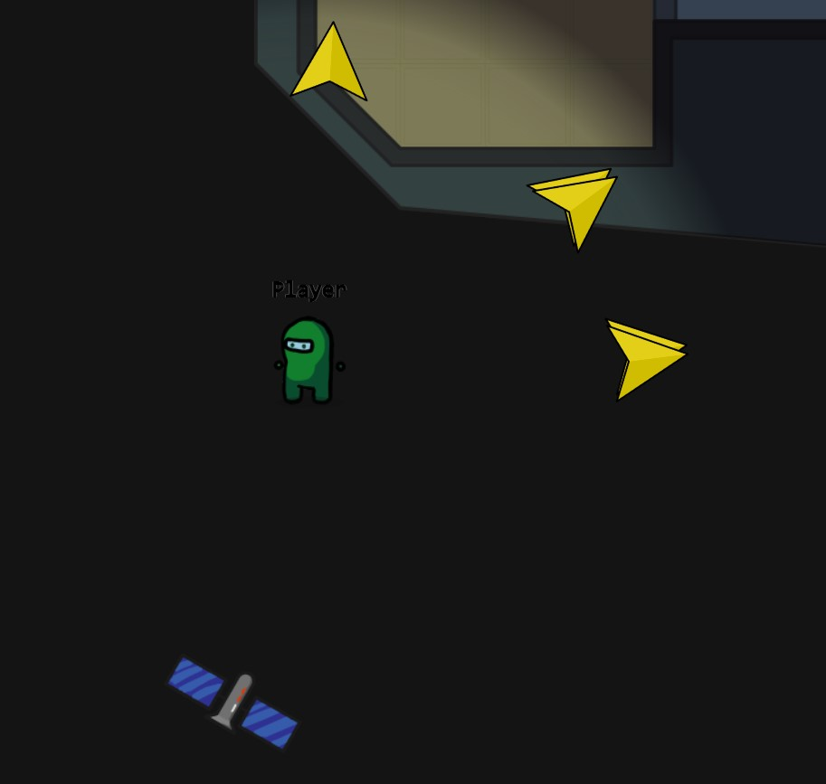
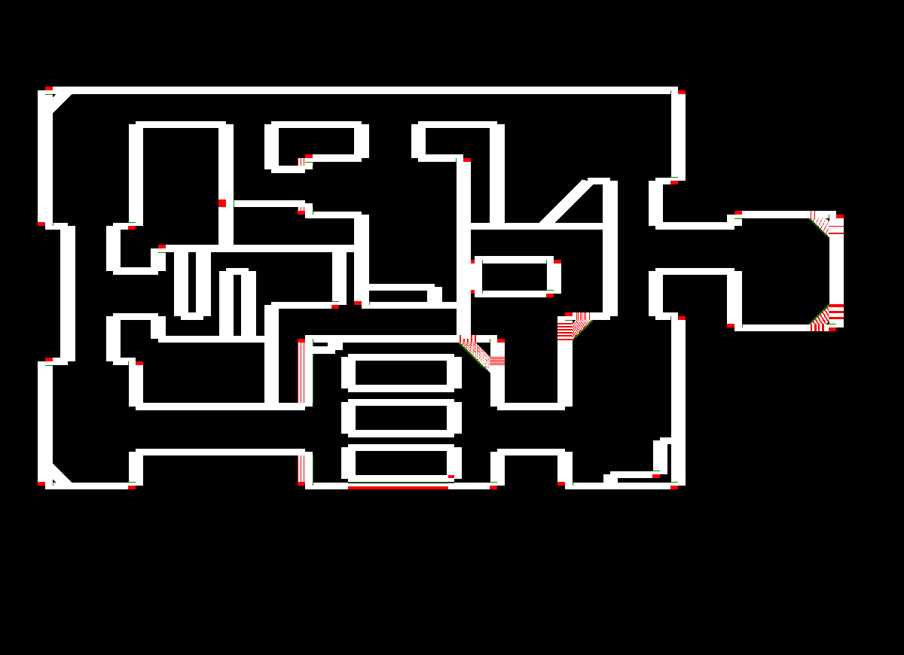
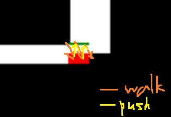
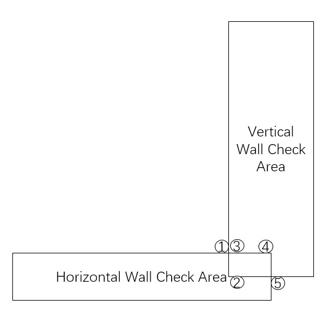
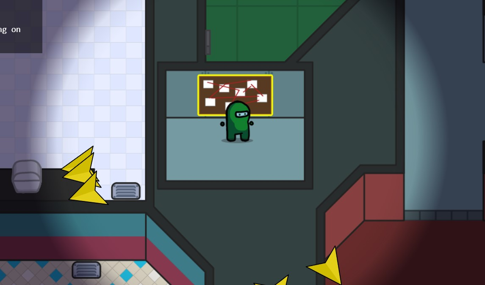
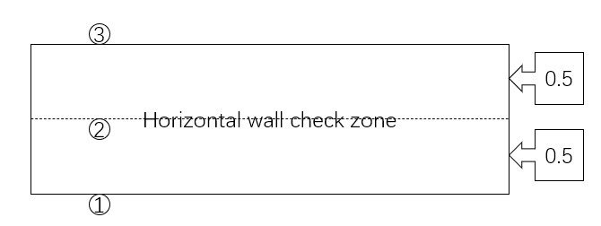

# A solution for Amongst Ourselves

This is a collection of challenges in [PlaidCTF2022](https://ctftime.org/event/1542).

## Shipmate

### Process Sample

According the code, the first and the second sample ID(if the panel is too quickly to be closed, see it in the Devtools) are converted to matrix $A,B$. And the flag are converted to matrix $C$. And $B=CA$ hold.

So, after get sample IDs by the first and the second player, and run the below code, I got the flag.

```python3
first_id = 'UXJGAIEVIK_EFWPQXWHWBNGMJ'
second_id = 'XUAHFBZMCOQLUTMSLKJRDVW!O'
alphabet = "ABCDEFGHIJKLMNOPQRSTUVWXYZ_!?"

def str2mat(s):
    return matrix(Zmod(29), 5, 5, [alphabet.index(c) for c in s]).T

def mat2str(m):
    return ''.join(alphabet[m[i,j]] for i in range(5) for j in range(5))

A = str2mat(first_id)
B = str2mat(second_id)
print(mat2str(B*~A))
# TEST_POSITIVE!_FR_GRAVEL?
```

### Provide Credentials

```javascript
		username = username.replace("'", "''");
		password = password.replace("'", "''");

		// Max length of username and password is 32
		username = username.substring(0, 32);
		password = password.substring(0, 32);

		pool.query<{ id: number; username: string }>(
			`SELECT id, username FROM users WHERE username = '${username}' AND password = '${password}'`
		)
```

This challenge is a simple SQL inject test.

Notice that the `''` at the index 31 and 32 will be cut into `'`, so we can use `1111111111111111111111111111111'` as username and `union select 1,* from flag;--` as password, which result in `SELECT id, username FROM users WHERE username = '1111111111111111111111111111111'' AND password = 'union select 1,* from flag;--'`, to get the flag.

### Recalibrate Engine

Use IDA to decompile the engine file and read the logic.

It require us repeat what he said 5 times and then the task succuess. But for this challenge, you need to pass the secret `6663232` and play a "pick stones" game with a random computer.

It's easy to satisfy these requirements by hand in the game panel.

### Purchase Snack

It's easy to find the stack overflow bug at 0x4013B2. And this program is no canary and pie, so just change the return address to the `print_flag` is OK.

So, the payload is `"11111111111111111111111\u00bd\u0014@\u0000\u0000\u0000\u0000\u0000"`.

The code of amongst provided a easy interface to input the payload at PurchaseSnackPanel.tsx#L22, we can input the payload by `setVendingMachineInput("11111111111111111111111\u00bd\u0014@\u0000\u0000\u0000\u0000\u0000")` and press the vend key, then we got the flag.

### Upload Data

Go to the device to download the file, and then use `open(URL.createObjectURL(new Blob([new Uint8Array(FileTransferController.downloadMap.get(15).split('').map(x => x.charCodeAt()))], {type: 'application/file'})))` to download the [content](./uploadData/sus.pcap).

Open the file by wireshark, we can found a lot of HTTP request with 206 response, so I use a [script](./uploadData/combiner.py) to combine them into a [picture file](./uploadData/sus.png).

PS: Since this challenge is solved by my teammate in the contest, I'm not sure whether the answer is correct or not.

## Hoaxer

### Contact Satellite

In this challenge, we've been required to move an alive player to the satellite device and open its panel to get the flag.



Hints:

1. `@amongst/game-common` be lookin' mad sus (and I'm not referring to anything in `constants.ts`)
2. It was nice of me to leave some comments in the code, but unfortunately, you can't believe everything you read.  *There is at least one hoaxer amongst the comments.*
3. I'm not saying that one of the comments is sus, I'm saying that one of the comments is stating something that's just plainly false.
4. For ` // Choose a random player to be a hoaxer`: It's not that one lol.

According to these hints, we focus on `LevelMap::applyWalls` in `packages/game-common/src/LevelMap.ts`

```typescript
	public applyWalls(point: Point): Point {
		const playerSize = new Point(PlayerWidth, PlayerWidth);
		const testBox = new Box(point.sub(playerSize.scale(0.5)), point.add(playerSize.scale(0.5)));
		const walls = this.wallMap.getPossibleCollisions(testBox);

		for (const wall of walls) {
			point = wall.pushPlayer(point);
		}

		return point;
	}
```

and `Wall::pushPlayer` in `packages/game-common/src/Wall.ts`.

```typescript
	public pushPlayer(point: Point): Point {
		// Compute the required displacement as if the player is a unit circle at the origin
		const start = this.start.sub(point).scale(2 / PlayerWidth, 2 / PlayerHeight);
		const end = this.end.sub(point).scale(2 / PlayerWidth, 2 / PlayerHeight);
		const lengthVector = end.sub(start);
		const lengthUnitVector = lengthVector.unit();
		const depthUnitVector = new Point(lengthUnitVector.y, -lengthUnitVector.x);
		const playerDepth = -depthUnitVector.dot(start);

		if (playerDepth < -1 || playerDepth > 1) {
			// Circle doesn't intersect the line
			return point;
		}

		const projectionDist = -lengthUnitVector.dot(start) / lengthVector.mag();

		if (projectionDist < 0 || projectionDist > 1) {
			// Circle intersects the line but not the segment
			return point;
		}

		const amountToPush = -1 - playerDepth;
		const pushVector = depthUnitVector.scale(amountToPush).scale(PlayerWidth / 2, PlayerHeight / 2);
		return point.add(pushVector);
	}
```

There are one comment is plainly false: `// Circle intersects the line but not the segment`. The actual judgment here is whether the projection of the line from `point` to the wall is on the wall, not the circle.

However, I read the code over and over again, and cannot find any exploitation.

So, I decided to use the simplest black box technique to find the problem.

Just run the [code](./drawPushPlayer.js)(follow the instruction in the comment), I get the below picture firstly:

In this picture, I use all points whose coordinates can be divided by 0.1 into the pushPlayer function, and draw black dot in all point it output.


There is no doubt that the corner of walls is suspective.

Can we escape the wall by using delta which can be divided by 0.1 and which is equals to `0.5+1e-8`?

To answer this question, I also draw all points that can be reach in a BFS search:


Obviously, the answer is no.

So I want to know how the suspective shapes in the corner of wall of the first picture exist?

I located these point by check whether the output point input into the applyWall function will be changed again, and marked them in green. And I marked the original point of these points in red:



It's easy to find a solution from this map:



For more accuracy, now I explain why it can work.

We can got the wall check area(where player will be pushed out by the wall) by reading the source code. The answer is the check area of a horzontal is a rectangle whose midpoints of its left and right edges is the start and end points of these wall, with a height of 1, and the check area of a vertical is a rectangle whose midpoints of its top and bottom edges is the start and end points of these wall, with a width of 2.

So the corner is looked like below:



That's say what will happen if we go to such a corner which will check the vertical wall before the horizontal wall(Only such walls are vulnerable) like `[24.5,19]` and then keeping move with a delta of `[0.00009, 0.5+1e-9]`.

For each tick:

1. The player begin at (1).
2. And then it move with a delta of `[0.00009, 0.5+1e-9]`, i.e. move from (1) to (2).
3. (Vertical Wall).pushPlayer, i.e. still at (2).
4. (Horizontal Wall).pushPlayer, i.e. move from (2) to (3).

So for each tick, we can go a little bit right. And after a certain tick, the player can be at (4).

Then, move with a delta of `[0.00009, 0.5+1e-9]` again, the player is at (5), so the player is out of the wall.

Note that each tick cost 50ms, so the exploit procedure cost about 10 min.

Write these steps by a [script](./flag2NodeScript.mjs)(Usage: Create a room and join three players and start the game, then run `node flag2NodeScript.mjs <roomId>`), then we can got the flag.

#### Network connection

Due to the ping to the server is really high in my location, I rent a ECS instance near the server, and run the script at that server.

And the script for Incite Conspiracy can be used here for keeping other players' connection alive.

#### Trap in math

Since the Euclidean distance of a single movement cannot exceed 0.5+1e-8, it is easy to have the illusion that once the absolute value of y component exceeds 0.5, the absolute value of x component cannot be higher than 1e-8.

But in fact, if the limitation of the Euclidean distance is $a+b$, where $a$ is a large number and the $b$ is a very small number relatively. When one component exceeds $a$, another component can reach about $\sqrt{b}$, which become acceptable in this case.

This trap impressed me long time ago.

#### Get the client game object

I use two way to get this.

In local test, I just add `(window as any).game = game;` into the codebase.

In the remote, I use a hook technique to get the game for the exposed `FileTransferController` class.

Firstly, run this code in Devtools to hook a function of controllers.

```javascript
let hooked = Object.getPrototypeOf(FileTransferController).prototype.detach;
globalThis.leakOut = [];
Object.getPrototypeOf(FileTransferController).prototype.detach = function (...args) {
	globalThis.leakOut = args;
	return hooked.apply(this, args);
};
```

After close any panel, run the code below to get game object.

```javascript
let [game, self] = globalThis.leakOut;
```

Additional, I put some junk [code](./miscCodes.js) in this repo.

### Incite Conspiracy

In this part, I just reproduce other player's solution, so there is no analysis process.

It's really useful to draw walls in this challenge, my code to draw the [dropship](./drawDropship.js) and the [both](./drawMap.js) can be found in this repo. Put the code into the Devtools for `about:blank`, then you can see the output.

In this challenge, we've been required to move an alive player to the conspiracy-board device and open its panel to get the flag.



Notice 5 points in the code:

1. The player's `recentLocation` won't be cleared when the player enter the shelld from dropship.
2. The order in the movement system is apply the delta -> applyWall -> applyBound -> deal with killing(including location change in killing).
3. The check allow a hoaxer to kill anoher player are: the distance between the hoaxer-provided point and the hoaxer is quite close; the hoaxer-provided point is equal to the current location of the player or one of its `recentLocation`; there are no wall between(not `hasWallBetween`) the hoaxer-provided point and the hoaxer.
4. When the player interact other system, the `recentLocation` won't be updated anymore.(Same goal can be achieved by always send invalid delta in movement system.)
5. Part of the positions that players can reach in dropship are very close to the Conspiracy room in shelld.

So, if a player go to a useful point in dropship and then the game start, this player immediately interacts with the immediate emergency button system. Then its `recentLocation` can always contains a certain position where player cannot reach directly in shelld.

A [script](./flag1NodeScript.mjs) to achieve such a goal can be found in the repo. The usage is create a room and run `node flag1NodeScript.mjs <roomId>` and just keep it running.

Note that for debug purpose, we can add a new API to get the recentLocation from the local server.



Now, to bypass `hasWallBetween`, we can select a position(2) near or on the horizontal wall we cannot reach directly. And then let the hoaxer(initially at (1)) kill this player to get its location(2)(due to the order of movement system, this gap won't `applyWall`), and then move with a delta of `[0,-0.5-1e-8]` to escape the wall check zone(3).

### Explore Environment

Just solve any problems above.
